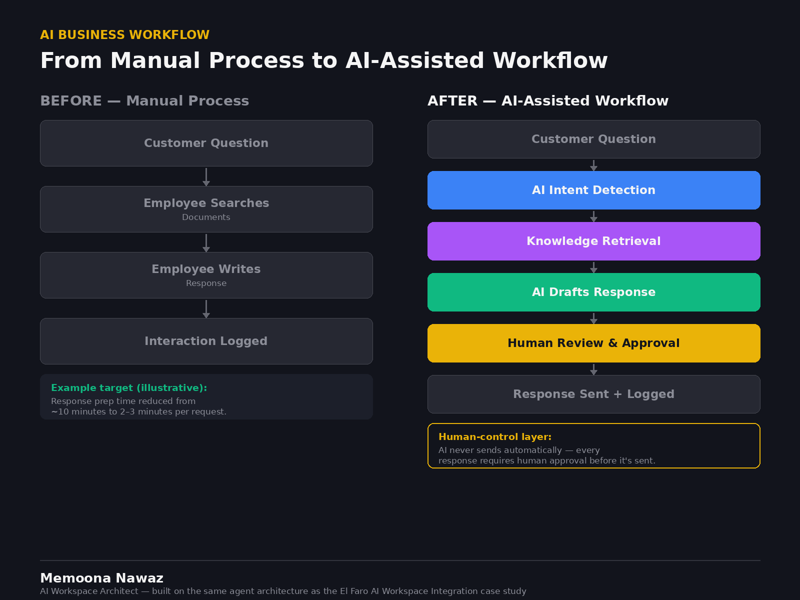
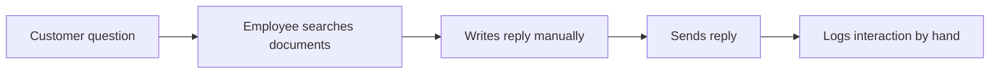
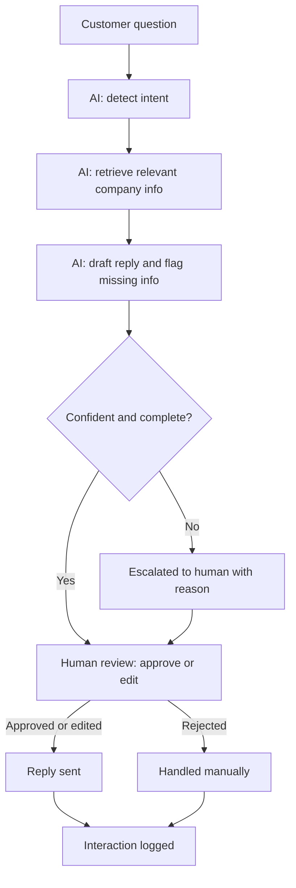

# AI-Assisted Customer Support Workflow

A LangGraph workflow that turns a manual support process into an AI-assisted, **human-controlled** one. The AI drafts and flags. A person approves. Nothing is sent without a human decision.

> Metrics in this README are **illustrative targets, not measured client results.**



## The business problem

Support teams get the same questions repeatedly. For each one, an employee searches internal documents, writes a reply from scratch, and logs the interaction by hand. This is slow, inconsistent, and uses expert time on routine work.

## Before and after

**Before: manual**



**After: AI-assisted, human-controlled**



## What the AI does

- **Classifies** the request (order status, refund, product info, complaint, other)
- **Retrieves** relevant passages from company documents, with source IDs
- **Drafts** a reply using only retrieved content
- **Identifies missing information** instead of guessing
- **Escalates** uncertain, incomplete, or sensitive cases (such as complaints) with a written reason

## The human-control layer

```
AI -> Recommendation/Draft -> Human Approval -> Action
```

- The workflow **pauses at a review step** (LangGraph `interrupt()`) and cannot reach the send step without a human decision: approve, edit, or reject.
- The AI is restricted to retrieved content and must not promise refunds, exceptions, or dates.
- Complaints, low-confidence answers, and missing information are **always flagged**, with the reason shown to the reviewer.
- Every interaction is **logged** to `interactions.jsonl`: question, intent, sources, AI draft, human action, final reply.

## Demo output

A run of the refund question: the intent is classified, the refund policy is retrieved, a draft is produced, the case is not escalated, and the approved reply is sent.


## How to run

```bash
pip install langgraph pydantic
python support_workflow.py
```

The workflow runs in **mock mode** by default: the classify and draft steps use simple keyword rules, so no API key is needed. This demonstrates the workflow structure (routing, escalation, human approval, logging), not language-model quality.

To use a real model, install `langchain-anthropic` and set `ANTHROPIC_API_KEY`. The same graph then uses Claude for classification and drafting.

## Illustrative business outcome

| Metric | Manual today | Example target |
|---|---|---|
| Response preparation time | ~10 min | 2-3 min |
| Answers traceable to a source document | Inconsistent | Every draft cites sources |
| Interaction logging | Manual, often skipped | Automatic |

*Example targets for illustration only.*

## Limitations and next steps

- The knowledge base is a small in-code list. A real deployment would connect to the client's documents (Drive, Notion, a help center, or a vector store).
- The send step is a stub. It would call an email or helpdesk API.
- The checkpointer is in-memory. Production use needs a persistent one (SQLite or Postgres) so paused reviews survive restarts.
- The confidence threshold and escalation rules need tuning on real tickets.

## Tech

Python, LangGraph (conditional edges, human-in-the-loop interrupt, checkpointer), Pydantic, optional Anthropic Claude.
